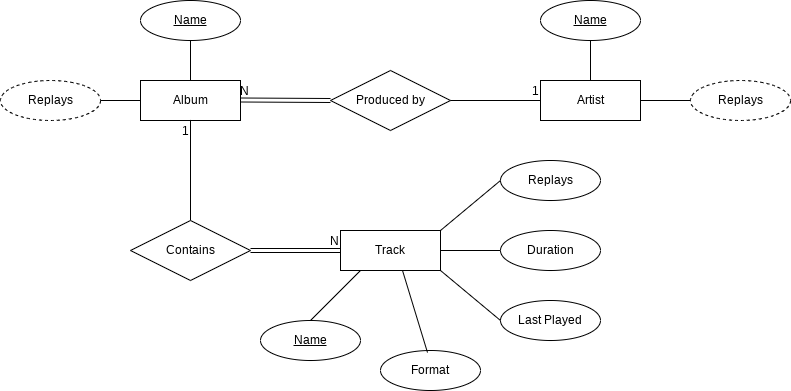

# DBatUI

## Description:
The database stores personal music. library
supports MP3, CD and vinyl collection formats
1. The collection consists of albums
2. The album belongs to only one artist (performer - artist)
3. The artist owns one or more albums
4. The album contains one or more tracks
5. Artists, albums, tracks - each has its own unique name
6. Each track belongs to exactly one album
7. Each track has a duration, measured in seconds
8. When a track is played, the date and time it started playing is saved. This data is used to display the following. info:
    - how many times this track was listened to for all time
    - how many times have you listened to songs from this album
    - how many times have you listened to the songs of this artist
Collaborators:
* Anastasiia Baranova - [a.baranova@innopolis.university]
* Aleksandr Lobanov - [a.lobanov@innopolis.university]
* Robert Chen - [r.chen@innopolis.university]
* Eugene Kuzyakhmetov - [e.kuzyakhmetov@innopolis.university]
