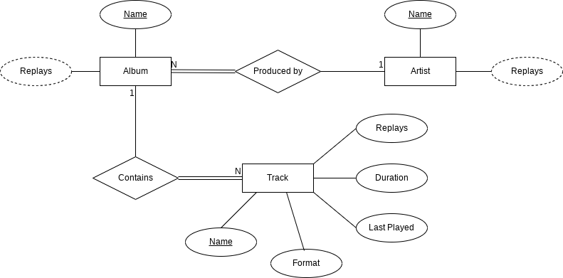

# DBatUI

## Description:
The database stores personal music. library
supports MP3, CD and vinyl collection formats
* The collection consists of albums
* The album belongs to only one artist (performer - artist)
* The artist owns one or more albums
* The album contains one or more tracks
* Artists, albums, tracks - each has its own unique name
* Each track belongs to exactly one album
* Each track has a duration, measured in seconds
* When a track is played, the date and time it started playing is saved. This data is used to display the following. info:
    - how many times this track was listened to for all time
    - how many times have you listened to songs from this album
    - how many times have you listened to the songs of this artist
